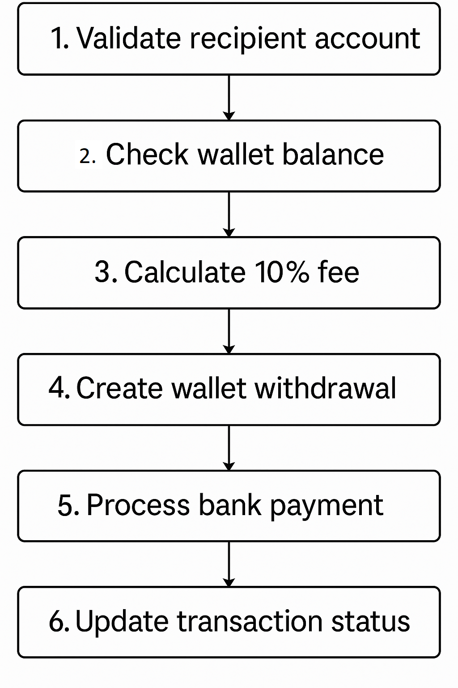
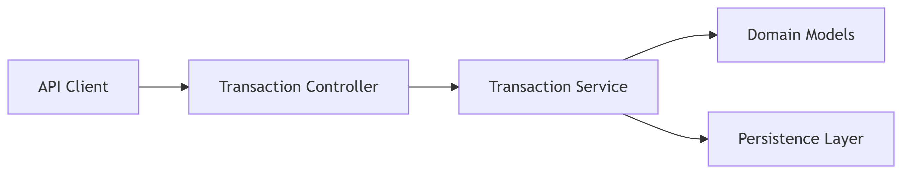
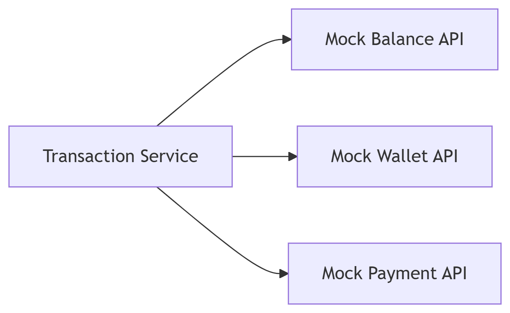
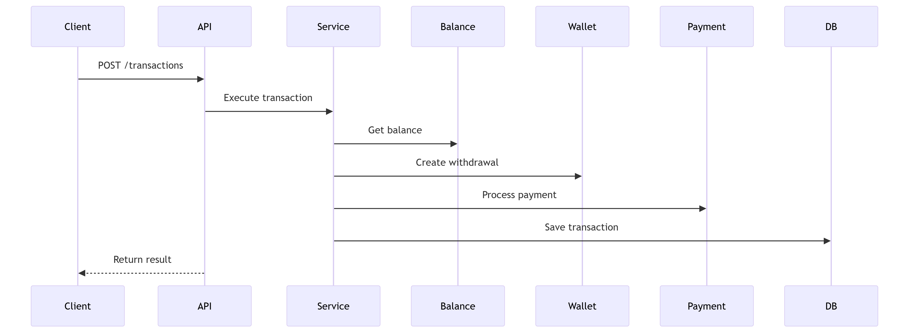
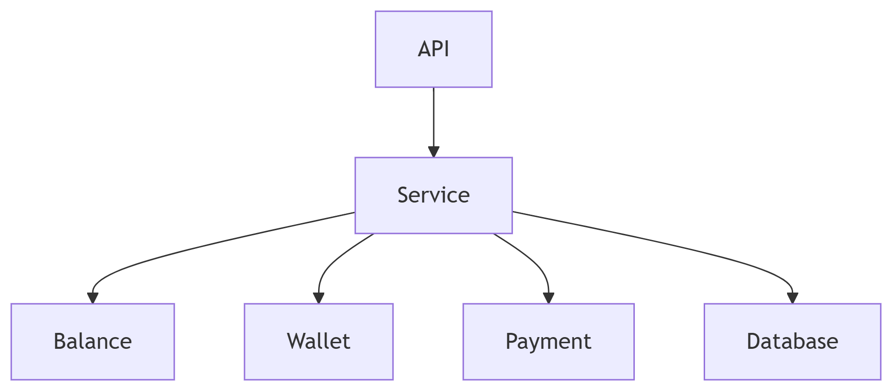

# Ontop Money Transfer API - Documentation


## Table of Contents
1. [Solution Overview](#1-solution-overview)
2. [Architecture & Design](#2-architecture--design)
3. [Technical Implementation](#3-technical-implementation)
4. [Testing Strategy](#4-testing-strategy)
5. [API Documentation](#5-api-documentation)
6. [Postman Collection](#6-postman-collection)
7. [How to Run & Deploy](#7-how-to-run--deploy)
8. [Future Improvements](#8-future-improvements)
9. [Diagrams](#9-diagrams)
10. [Compliance](#10-compliance-with-ontop-requirements)

---

## 1. Solution Overview

A production-ready REST API for money transfers featuring:
- 10% transaction fee deduction
- Wallet-to-bank transfers
- Mock external service integration
- Resilient error handling
- H2 in-memory database
- 85%+ test coverage

**Key Technologies**:
- Java 17
- Spring Boot 3.1
- H2 Database
- JUnit 5
- Mockito
- RestTemplate

---

## 2. Architecture & Design

### Hexagonal Architecture


         
         
         
**Key Design Decisions**:
- Domain-Centric: Business logic isolated from frameworks
- Ports & Adapters: Clear boundaries between components
- Resilience: Timeouts, retries, and fallbacks
- Testability: Mock external dependencies


## 3. Technical Implementation

### Package Structure
```text
com.ontop.challenge
├── application            # Use cases and services
├── domain                 # Core business logic
├── infrastructure         # External adapters
└── presentation           # API endpoints
```

**Core Flow**:
1. Validate recipient account
2. Check wallet balance
3. Calculate 10% fee
4. Create wallet withdrawal
5. Process bank payment
6. Update transaction status




## 4. Testing Strategy
```text
        ↗ API Tests (20%)
      ↗ Service Tests (30%)
    ↗ Unit Tests (50%)
```

**Test Types**:

```text
TransactionServiceTest: Business logic validation
BalanceRestAdapterTest: HTTP client behavior
TransactionControllerIT: Full API integration
```

## 5. API Documentation

**Execute Transactions**:
Endpoint: POST /api/v1/transactions

**Request**:

```text
{
    "userId": 1000,
    "amount": 100,
    "recipientAccountId": "acc-123"
}
```

**Responses**:

```text
Status		Scenario
200 		OK	Success
400 		Bad Request	Validation error
404 		Not Found	Recipient not found
500 		Server Error	Processing failure
```

## 6. Postman Collection

**How to use**:

```text
In Postman import Ontop_Money_Transfer_API.postman_collection.json file located at ontop-bc/docs/postman/ directory

Collection Includes:
Endpoint				Type		Scenarios Covered
/transactions				POST		Happy path, insufficient funds, invalid recipient
/wallets/balance			GET		Mock service example

Environment Setup:
Create a Postman environment variable:
base_url = http://localhost:8080


Tests Included:
Status code validation
Response time checks
Example test scripts for payload validation

```

## 7. How to run and deploy

**Local development**:

```text
mvn clean install
mvn spring-boot:run
```
**H2 Console**:

```text
URL: http://localhost:8080/h2-console
JDBC URL: jdbc:h2:mem:ontopdb
User: sa (no password)
```

## 8. Future improvements

```text
Improvement					Priority
Event Sourcing					High
Security					High
Monitoring					High
Health Checks					High
Distributed Tracing				Medium
Kafka Integration				Medium
Kubernetes Deployment				Low
Package refactoring				Low
```

## 9. Diagrams

**Core application**:



**External services**:



**Sequence Diagram**:



**Components Diagram**:




## 10. Compliance with Ontop requirements

```text
Requirement				Status		Notes
10% Fee					✅		Exact calculation
Status Tracking				✅		4 statuses supported
External Mocks				✅		Full implementation
SOLID Principles			✅		Verified in review
Testing					✅		85% coverage
```


## 👨‍💻 Autor

Reinaldo Otálvaro  